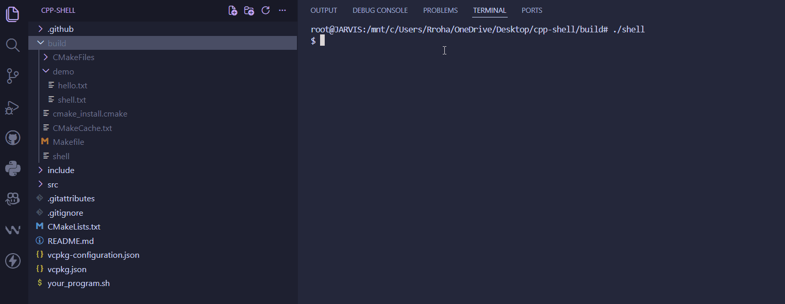

# CPP Shell


A **Unix-like command-line shell** built in **Modern C++** using **POSIX system calls**.

It supports command execution, pipelines, I/O redirection, background jobs, persistent history, variable expansion, and intelligent tab completion.

---

## Features

- Interactive command prompt
- Execute external programs
- Built-in commands
  - `cd`
  - `pwd`
  - `echo`
  - `type`
  - `exit`
  - `history`
  - `declare`
- Command history
- Persistent history using `HISTFILE`
- Variable declaration and expansion
- Tab completion
- Custom command completers
- Input/Output redirection (`>`, `>>`, `<`)
- Pipelines (`|`)
- Background jobs (`&`)
- Backspace support
- Raw terminal mode

---

## Demo

<p align="center">
  
</p>

---

## Project Structure

```
cpp-shell/
│
├── include/
│   ├── parser.h
│   ├── history.h
│   ├── autoComplete.h
│   ├── builtins.h
│   ├── commandExecutor.h
│   ├── executeProgram.h
│   ├── terminal.h
│   ├── jobs.h
│   ├── variables.h
│   ├── redirection.h
│   ├── pipeline.h
│   └── completeRegistry.h
│
├── src/
│   ├── main.cpp
│   ├── parser.cpp
│   ├── history.cpp
│   ├── autoComplete.cpp
│   ├── builtins.cpp
│   ├── commandExecutor.cpp
│   ├── executeProgram.cpp
│   ├── terminal.cpp
│   ├── jobs.cpp
│   ├── variables.cpp
│   ├── redirection.cpp
│   ├── pipeline.cpp
│   └── completeRegistry.cpp
│
│
├── build/
├── CMakeLists.txt
└── README.md
```

---

## Build

### Requirements

- Linux / WSL
- CMake
- GCC 16+
- Readline

Install dependencies:

```bash
sudo apt update
sudo apt install cmake g++ libreadline-dev
```

Clone the repository:

```bash
git clone git@github.com:Rohan-Revu/cpp-shell.git
cd cpp-shell
```

Build:

```bash
mkdir build
cd build

cmake ..
cmake --build .
```

Run:

```bash
./shell
```

---

## Built-in Commands

| Command | Description                      |
| ------- | -------------------------------- |
| cd      | Change directory                 |
| pwd     | Print working directory          |
| echo    | Print arguments                  |
| exit    | Exit the shell                   |
| type    | Identify command type            |
| history | Display command history          |
| declare | Create and print shell variables |

---

## Supported Shell Features

| Feature            | Status |
| ------------------ | ------ |
| External Commands  | ✅     |
| Built-ins          | ✅     |
| Pipelines          | ✅     |
| Redirection        | ✅     |
| Background Jobs    | ✅     |
| History            | ✅     |
| Variable Expansion | ✅     |
| Tab Completion     | ✅     |
| Persistent History | ✅     |

---

## Architecture

```
User Input
     │
     ▼
 Terminal
     │
     ▼
 Parser
     │
     ▼
 Command Executor
     │
     ├── Builtins
     ├── External Programs
     ├── Pipelines
     └── Redirections
```
